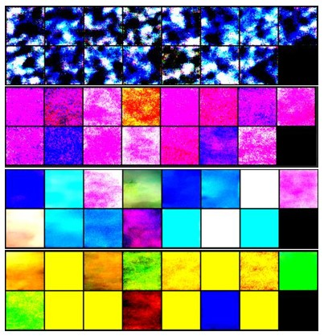

# Stable_Diffusion_from_scratch

I've been trying to understand diffusion models by just reading about it, but it was tricky to understand everything, so taking inspiration from many forums I tried to implement this myself, I tried to comment the most important parts to help understand everything.

This code implements the ddpm paper without classifier free guidance, I trained this system on google colab and due to this I could not train this model for a long time, but here in the images below you can see that the landscapes are getting better and better, if you can train this model for more epochs you will obtain really good results.




To run the code just run:
```python
python ddpm.py
```

Be sure to change the paths, according to your needs. This code uses the [landscape dataset](https://www.kaggle.com/datasets/arnaud58/landscape-pictures).
